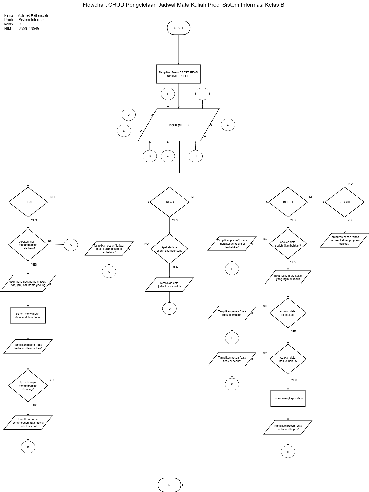

# Mini-Project-DDP-P1
# Tema  : Pengelolaan Jadwal Matkul Prodi Sistem Informasi Kelas B
# Nama  : Akhmad Rafliansyah
# prodi : Sistem Informasi
# kelas : B
# NIM   : 2509116045

## Flowchart

**Penjelasan Flowchart:**
1. Program dimulai dari **START**
2. User akan melihat beberapa menu pilihan yaitu **CREAT**, **READ**, **DELETE**, **LOGOUT**.
3. User akan memilih 1 dari 4 pilihan
4. Jika user memilih **CREAT** maka akan ada 2 pilihan yaitu ingin menambahkan data baru atau tidak. jika user memilih tidak maka user akan langsung menuju menu utama lagi. jika user memilih ingin menambahkan data baru maka user harus menginput nama matkul, hari, jam, dan nama gedung. setelah itu sistem akan menyimpan data ke dalam daftar dan akan mendapatkan pesan yaitu "data berhasil di tambahkan". alur berlanjut user akan mendapatkan dua pilihan lagi yaitu ingin menambahkan data
